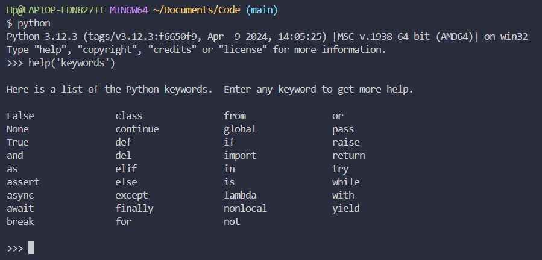

# 💻 Exercises - Day 2

## Exercise: Level 1

### 1. Write a python comment saying 'Day 2: 30 Days of python programming'

```python
# Day 2: 30 Days of python programming
```
### 2. Declare a fews variables

```python
first_name = "Victor"
last_name = "Hernandez"
full_name = "Victor Hernandez"
country = "Venezuela"
city = "Maturin"
age = 41
year = 2024
is_married = False
is_true = True
is_light_on = True
variable_1, variable_2 = 1, 3
```

## Exercises: Level 2
### 1. Check the data type of all your variables using `type()` built-in function

```python
print(type(first_name))
print(type(last_name))
print(type(full_name))
print(type(country))
print(type(city))
print(type(age))
print(type(year))
print(type(is_married))
print(type(is_true))
print(type(is_light_on))
print(type(variable_1))
print(type(variable_2))
```

### 2. Using the `len()` built-in function, find the length of your first name

```python
print(len(first_name))
```

### 3. Compare the length of your first name and your last name
```python
longitud_nombre = len(first_name)
longitud_apellido = len(last_name)

print(f"La longitud de mi nombre es: {longitud_nombre} y la longitud de mi apellido es: {longitud_apellido}")
```

### 4. Declare 5 as num_one and 4 as num_two
```python
num_one, num_two = 5, 4
```
#### i. Add num_one and num_two and assign the value to a variable total

```python
total = num_one + num_two
```
#### ii. Subtract num_two from num_one and assign the value to a variable diff

```python
diff = num_one - num_two
```
#### iii. Multiply num_two and num_one and assign the value to a variable product

```python
product = num_two * num_one
```
#### iv. Divide num_one by num_two and assign the value to a variable division

```python
division = num_one / num_two
```
#### v. Use modulus division to find num_two divided by num_one and assign the value to a variable remainder

```python
remainder = num_two % num_one
```
#### vi. Calculate num_one to the power of num_two and assign the value to a variable exp

```python
exp = num_one ** num_two
```
#### vii. Find floor division of num_one by num_two and assign the value to a variable floor_division

```python
floor_division = num_one // num_two
```

### 5. The radius of a circle is 30 meters.
```python
radius_circle = 30
diametro = radius_circle * 2
pi = 3.1416
```

#### i. Calculate the area of a circle and assign the value to a variable name of area_of_circle
```python
area_of_circle = pi * radius_circle ** 2
print(f"El area del circulo es: {area_of_circle}")
```

#### ii. Calculate the circumference of a circle and assign the value to a variable name of circum_of_circle
```python
circum_of_circle = pi * diametro
print(f"La circunferencia es: {circum_of_circle}")
```

#### iii. Take radius as user input and calculate the area.

```python
user_radius = int(input(f"Ingrese el radio del circulo: "))
user_area = pi * user_radius ** 2
print(f"El area del circulo es: {user_area}")
```

### 6. Use the built-in input function to get first name, last name, country and age from a user and store the value to their corresponding variable names

```python
user_firstname = input(F"Ingrese su nombre: ")
user_lastname = input(F"Ingrese su Apellido: ")
user_country = input(F"Ingrese su pais de nacimiento: ")
user_age = int(input(F"Ingrese su edad "))

print(f"Su nombre es {user_firstname} {user_lastname}, nacio en {user_country} y su edad es de {user_age} años")
```

### Run help('keywords') in Python shell or in your file to check for the Python reserved words or keywords

